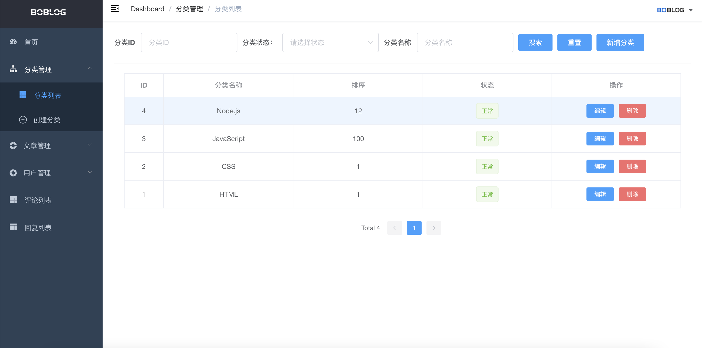

## 博客管理后台

一个基于 Vue 完整的管理后台，包含登录权限，文章管理，分类管理，用户管理，评论管理，回复管理模块

- 技术栈：Vue.js, Vuex, vue-router
- UI 框架：Element-UI
- Node.js 服务端 API 接口项目：[https://github.com/lfb/nodejs-koa-blog](https://github.com/lfb/nodejs-koa-blog)
- 欢迎大家指导~

## 安装启动
```
# 安装包
npm install 或者 yarn install

# 启动
npm dev 或者 yarn dev
```


